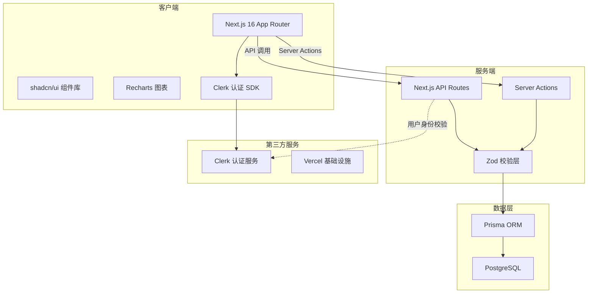
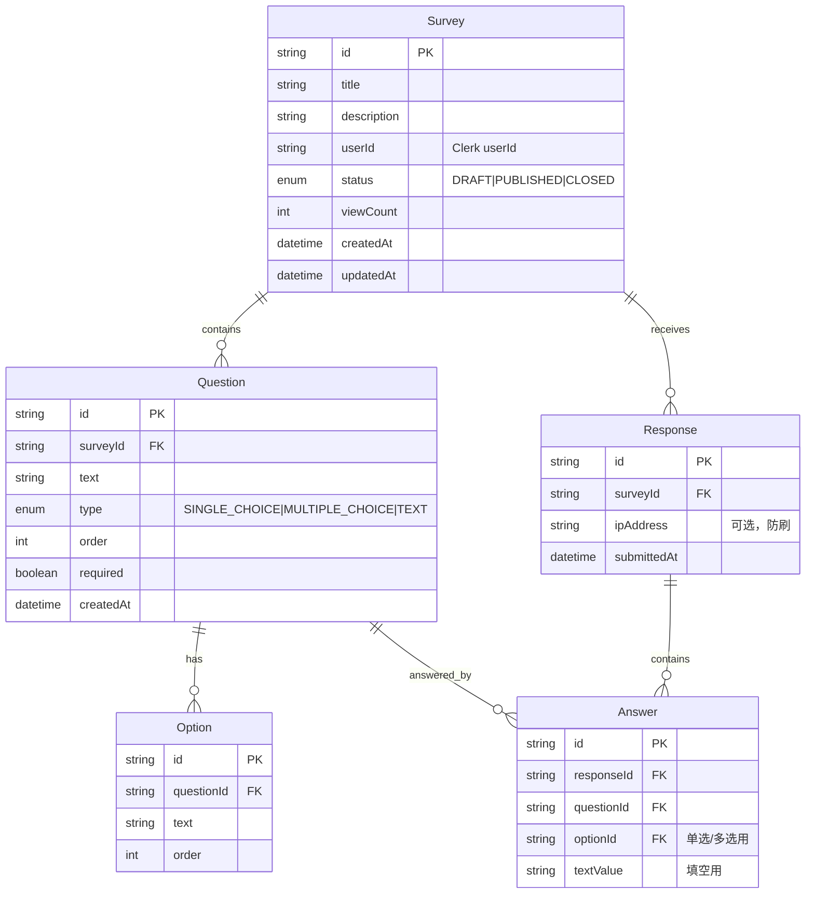
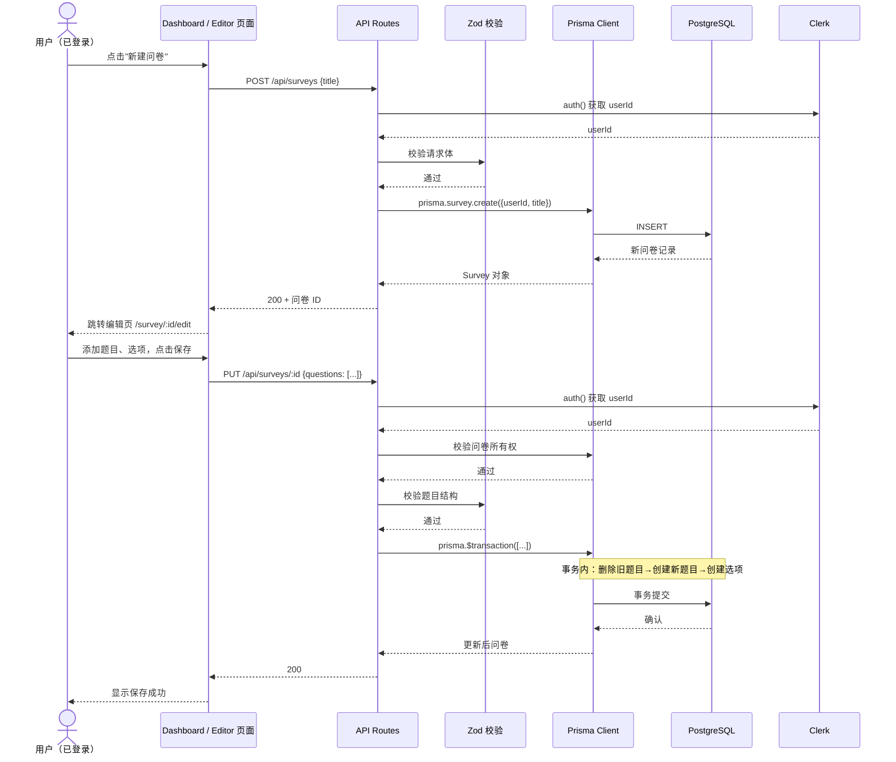
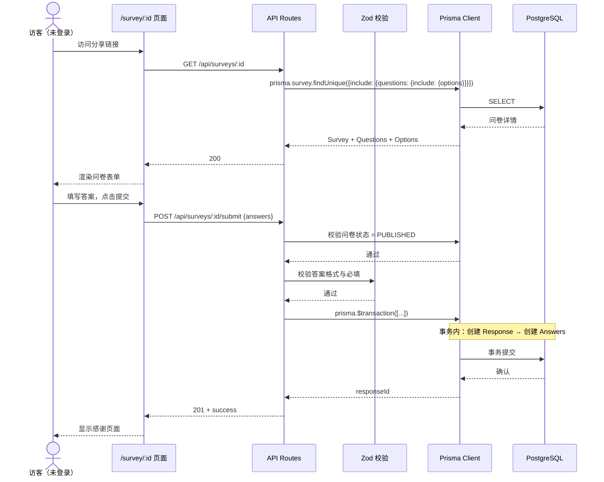
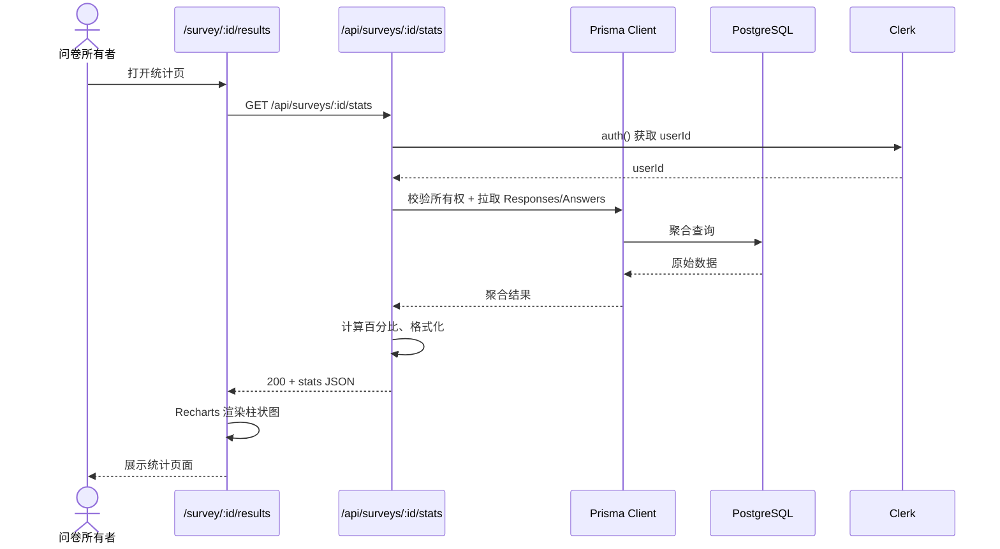
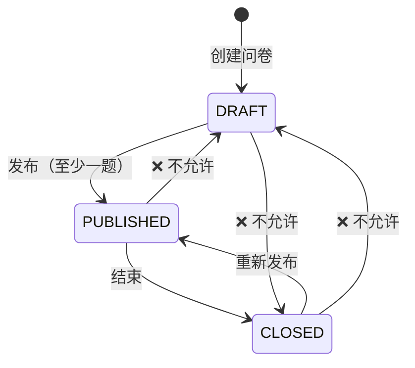
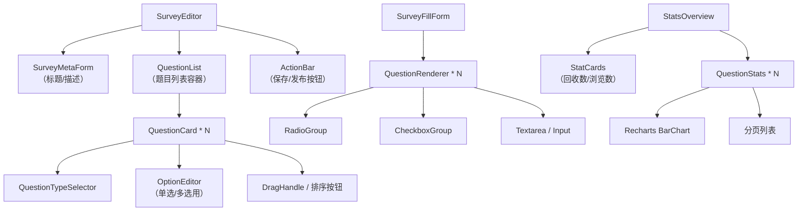

# 项目架构文档（architecture.md）

> 本文件基于 PRD、技术栈选型和实施计划推导得出，用于指导开发阶段的模块划分与接口设计。

---

## 1. 系统架构概览



---

## 2. 目录结构与模块职责

```
questionnaire/
├── app/                          # Next.js 15 App Router 主目录
│   ├── layout.tsx                # 根布局，注入 ClerkProvider、全局样式
│   ├── page.tsx                  # 首页（引导页或重定向到 dashboard）
│   ├── globals.css               # Tailwind 全局样式 + shadcn 主题变量
│   │
│   ├── api/                      # API 路由层（接口先行）
│   │   ├── surveys/
│   │   │   ├── route.ts          # GET 列表 / POST 创建问卷
│   │   │   └── [id]/
│   │   │       ├── route.ts      # GET 详情 / PUT 更新 / DELETE 删除
│   │   │       ├── publish/route.ts   # POST 发布问卷
│   │   │       ├── close/route.ts     # POST 结束问卷
│   │   │       ├── reopen/route.ts    # POST 重新发布
│   │   │       ├── submit/route.ts    # POST 提交答卷（公开，无需登录）
│   │   │       └── stats/route.ts     # GET 统计详情（需所有权校验）
│   │   └── responses/
│   │       └── [id]/route.ts     # GET 单份答卷详情
│   │
│   ├── dashboard/                # 管理端：问卷列表页
│   │   └── page.tsx              # 展示当前用户所有问卷，支持状态筛选
│   │
│   ├── survey/
│   │   ├── [id]/
│   │   │   ├── page.tsx          # 访客端：问卷填写页（公开访问）
│   │   │   ├── edit/
│   │   │   │   └── page.tsx      # 管理端：问卷编辑器（题目增删改、排序）
│   │   │   └── results/
│   │   │       └── page.tsx      # 管理端：数据统计与可视化页
│   │   └── layout.tsx            # survey 路由组共享布局（如加载状态）
│   │
│   └── (auth)/                   # 认证相关路由分组（可选）
│       ├── sign-in/[[...sign-in]]/page.tsx
│       └── sign-up/[[...sign-up]]/page.tsx
│
├── components/
│   ├── ui/                       # shadcn/ui 基础组件（Button、Input、Card 等）
│   ├── survey/
│   │   ├── SurveyEditor.tsx      # 问卷编辑器核心组件（题目列表、表单）
│   │   ├── QuestionCard.tsx      # 单题卡片（单选/多选/填空）
│   │   ├── QuestionTypeSelector.tsx  # 题型选择器
│   │   ├── OptionEditor.tsx      # 选项编辑器（增删改选项）
│   │   ├── SurveyFillForm.tsx    # 问卷填写表单（访客端）
│   │   ├── ShareLinkModal.tsx    # 分享链接弹窗
│   │   └── StatusBadge.tsx       # 问卷状态标签
│   ├── stats/
│   │   ├── StatsOverview.tsx     # 统计概览（回收数、浏览数）
│   │   ├── ChoiceChart.tsx       # 单选/多选柱状图
│   │   ├── TextAnswerList.tsx    # 填空题答案列表（分页）
│   │   └── ResponseDetailModal.tsx   # 单份答卷详情弹窗
│   └── layout/
│       ├── Header.tsx            # 顶部导航（含登录态）
│       ├── Sidebar.tsx           # 侧边栏（如需要）
│       └── EmptyState.tsx        # 空状态引导组件
│
├── lib/                          # 工具库与共享逻辑
│   ├── prisma.ts                 # Prisma Client 单例（全局唯一实例）
│   ├── validations.ts            # Zod Schema（问卷/题目/选项/答卷校验）
│   ├── api.ts                    # 前端 API 调用封装（fetch 包装器）
│   ├── auth.ts                   # Clerk 认证辅助函数（获取 userId 等）
│   └── utils.ts                  # 通用工具函数（cn、格式化等）
│
├── prisma/
│   └── schema.prisma             # 数据库模型定义（Survey/Question/Option/Response/Answer）
│
├── public/                       # 静态资源
│
├── types/                        # 全局 TypeScript 类型（API 返回类型、组件 Props）
│   └── index.ts
│
├── hooks/                        # 自定义 React Hooks
│   ├── useSurveys.ts             # 问卷列表数据获取
│   ├── useSurvey.ts              # 单问卷数据获取与 mutations
│   └── useStats.ts               # 统计数据获取
│
├── middleware.ts                 # Next.js 中间件（Clerk 路由保护）
├── next.config.js                # Next.js 配置
├── postcss.config.mjs            # PostCSS 配置（Tailwind v4 插件）
├── tsconfig.json                 # TypeScript 配置
└── package.json
```

> **当前状态（步骤 1.1 完成后）**：基础框架已初始化，`app/api/`、`app/dashboard/`、`app/survey/`、`components/`、`lib/`、`prisma/`、`hooks/`、`types/` 等目录尚未创建，将在后续步骤中按需生成。

---

## 2.1 配置文件说明

| 文件 | 说明 |
|------|------|
| `next.config.ts` | Next.js 配置（当前为空配置，后续可扩展 output、images 等） |
| `postcss.config.mjs` | PostCSS 配置，已集成 `@tailwindcss/postcss`（Tailwind v4） |
| `eslint.config.mjs` | ESLint 配置，使用 `eslint-config-next` |
| `tsconfig.json` | TypeScript 配置，包含 `@/*` 路径别名指向 `./src/*` |
| `pnpm-workspace.yaml` | pnpm workspace 配置（单项目空 workspace） |

> **注意**：Tailwind CSS v4 不再使用 `tailwind.config.ts`，主题变量通过 `src/app/globals.css` 中的 `@theme inline` 指令定义。

---

## 3. 数据模型与 ER 图



### 3.1 关键约束说明

| 约束 | 说明 |
|------|------|
| `onDelete: Cascade` | Survey 删除时级联删除 Question、Option、Response、Answer |
| `userId` | 业务层关联 Clerk 用户，类型为 `String`，不做外键约束 |
| `Response.ipAddress` | 可选字段，用于基础防刷策略 |
| `Answer` | 单选：`optionId` 有值；多选：多条记录各带 `optionId`；填空：`textValue` 有值 |

---

## 4. 接口定义

### 4.1 REST API 路由表

| 方法 | 路由 | 认证 | 说明 |
|------|------|------|------|
| `GET` | `/api/surveys` | 是 | 获取当前用户问卷列表 |
| `POST` | `/api/surveys` | 是 | 创建新问卷 |
| `GET` | `/api/surveys/:id` | 否* | 获取问卷详情（*填写页公开访问） |
| `PUT` | `/api/surveys/:id` | 是 | 更新问卷（标题、描述、题目） |
| `DELETE` | `/api/surveys/:id` | 是 | 删除问卷及级联数据 |
| `POST` | `/api/surveys/:id/publish` | 是 | 发布问卷（草稿→已发布） |
| `POST` | `/api/surveys/:id/close` | 是 | 结束问卷（已发布→已结束） |
| `POST` | `/api/surveys/:id/reopen` | 是 | 重新发布（已结束→已发布） |
| `POST` | `/api/surveys/:id/submit` | 否 | 提交答卷（公开接口） |
| `GET` | `/api/surveys/:id/stats` | 是 | 获取问卷统计数据 |
| `GET` | `/api/responses/:id` | 是 | 获取单份答卷详情 |

### 4.2 核心接口请求/响应契约

#### 创建问卷 `POST /api/surveys`

```typescript
// Request Body (Zod Schema)
{
  title: string,           // 必填，1-200 字符
  description?: string     // 可选
}

// Response 200
{
  id: string,
  title: string,
  description: string | null,
  status: "DRAFT",
  createdAt: string
}
```

#### 更新问卷 `PUT /api/surveys/:id`

```typescript
// Request Body
{
  title?: string,
  description?: string,
  questions: Array<{
    id?: string,           // 新建无 id，更新有 id
    text: string,
    type: "SINGLE_CHOICE" | "MULTIPLE_CHOICE" | "TEXT",
    order: number,
    required: boolean,
    options?: Array<{
      id?: string,
      text: string,
      order: number
    }>
  }>
}

// Response 200
{
  id: string,
  title: string,
  // ...完整问卷对象
}
```

#### 提交答卷 `POST /api/surveys/:id/submit`

```typescript
// Request Body
{
  answers: Array<{
    questionId: string,
    optionId?: string,      // 单选用
    optionIds?: string[],   // 多选用
    textValue?: string      // 填空用
  }>
}

// Response 201
{
  responseId: string,
  message: "提交成功"
}

// Error 400 — 校验失败示例
{
  error: "VALIDATION_ERROR",
  details: [
    { questionId: "xxx", message: "必填题目未回答" }
  ]
}
```

#### 获取统计 `GET /api/surveys/:id/stats`

```typescript
// Response 200
{
  surveyId: string,
  totalResponses: number,   // 总回收数
  viewCount: number,        // 浏览数
  questions: Array<{
    questionId: string,
    questionText: string,
    type: "SINGLE_CHOICE" | "MULTIPLE_CHOICE" | "TEXT",
    // 单选/多选
    options?: Array<{
      optionId: string,
      text: string,
      count: number,
      percentage: number
    }>,
    // 填空
    textAnswers?: Array<{
      responseId: string,
      textValue: string,
      submittedAt: string
    }>
  }>
}
```

---

## 5. 数据流

### 5.1 问卷创建与编辑流



### 5.2 问卷填写与提交流



### 5.3 统计查询流



---

## 6. 认证与权限控制

### 6.1 Clerk 集成点

| 位置 | 职责 |
|------|------|
| `app/layout.tsx` | 包裹 `ClerkProvider`，提供全局认证上下文 |
| `middleware.ts` | 使用 `clerkMiddleware` 保护 `/dashboard`、`/survey/*/edit`、`/survey/*/results` 等路由，未登录重定向到 `/sign-in` |
| `app/api/*` | 使用 `auth()` 获取 `userId`，业务表通过 `userId` 关联，不做数据库外键 |
| `app/survey/[id]/page.tsx` | 公开页面，不调用 `auth()`，允许匿名访问 |

### 6.2 权限矩阵

| 操作 | 所有者 | 其他登录用户 | 未登录访客 |
|------|--------|-------------|-----------|
| 创建问卷 | ✅ | ✅ | ❌（被 middleware 拦截） |
| 编辑/删除问卷 | ✅ | ❌ 403 | ❌ 403 |
| 发布/结束/重新发布 | ✅ | ❌ 403 | ❌ 403 |
| 查看统计 | ✅ | ❌ 403 | ❌ 403 |
| 查看问卷详情 | ✅ | ✅ | ✅（需已发布） |
| 提交答卷 | — | — | ✅（仅 PUBLISHED） |

---

## 7. 问卷状态机



### 7.1 状态对行为的影响

| 状态 | 允许编辑 | 允许填写 | 允许查看统计 |
|------|---------|---------|-------------|
| DRAFT | ✅ | ❌（返回提示） | ❌（无数据） |
| PUBLISHED | ✅ | ✅ | ✅ |
| CLOSED | ❌ | ❌（返回结束提示） | ✅ |

---

## 8. 前端组件架构

### 8.1 页面与组件映射

| 页面路由 | 核心组件 | 数据来源 |
|---------|---------|---------|
| `/dashboard` | `SurveyList` + `StatusFilter` | `GET /api/surveys` |
| `/survey/[id]/edit` | `SurveyEditor` + `QuestionCard[]` + `OptionEditor` | `GET /api/surveys/:id` → `PUT` |
| `/survey/[id]` | `SurveyFillForm` + `QuestionRenderer` | `GET /api/surveys/:id` → `POST /submit` |
| `/survey/[id]/results` | `StatsOverview` + `ChoiceChart` + `TextAnswerList` | `GET /api/surveys/:id/stats` |

### 8.2 组件层次图



---

## 9. 数据校验策略（Zod）

所有 API 入参统一在 `lib/validations.ts` 定义，前后端共用。

```typescript
// 核心 Schema 结构（示意）
const QuestionType = z.enum(["SINGLE_CHOICE", "MULTIPLE_CHOICE", "TEXT"]);

const OptionSchema = z.object({
  id: z.string().optional(),      // 更新时有，新建时无
  text: z.string().min(1).max(200),
  order: z.number().int().min(0)
});

const QuestionSchema = z.object({
  id: z.string().optional(),
  text: z.string().min(1).max(500),
  type: QuestionType,
  order: z.number().int().min(0),
  required: z.boolean().default(false),
  options: z.array(OptionSchema)
    .min(2, "单选/多选至少2个选项")
    .optional()
    .refine(
      (opts, ctx) => {
        const type = ctx.parent?.type;
        if ((type === "SINGLE_CHOICE" || type === "MULTIPLE_CHOICE") && (!opts || opts.length < 2)) {
          return false;
        }
        return true;
      }
    )
});

const SurveyUpdateSchema = z.object({
  title: z.string().min(1).max(200).optional(),
  description: z.string().max(1000).optional(),
  questions: z.array(QuestionSchema).min(1, "发布前至少一题")
});

const SubmitAnswerSchema = z.object({
  questionId: z.string(),
  optionId: z.string().optional(),
  optionIds: z.array(z.string()).optional(),
  textValue: z.string().optional()
}).refine((data) => {
  // 根据题型校验字段存在性
});
```

---

## 10. 错误处理约定

| HTTP 状态 | 场景 | 响应格式 |
|----------|------|---------|
| `400` | 参数校验失败、非法状态流转 | `{ error: string, details?: Array }` |
| `403` | 越权操作（非所有者） | `{ error: "FORBIDDEN" }` |
| `404` | 问卷/记录不存在 | `{ error: "NOT_FOUND" }` |
| `409` | 业务冲突（如空问卷发布） | `{ error: "CONFLICT", message: string }` |
| `429` | 限流触发 | `{ error: "TOO_MANY_REQUESTS" }` |
| `500` | 服务器内部错误 | `{ error: "INTERNAL_ERROR" }` |

---

## 11. 性能与扩展考虑

| 场景 | 策略 |
|------|------|
| 统计查询慢（大问卷） | Prisma 聚合 + 数据库索引；必要时缓存 stats 结果 |
| 高并发提交 | API 路由层加 Rate Limit（每 IP 每秒 10 次） |
| 图片/静态资源 | 走 Next.js 自动优化 + Vercel CDN |
| 数据库连接 | Prisma Connection Pooling（Vercel 无状态函数需要） |

---

*文档版本：v1.0 | 生成日期：2026-04-22*
